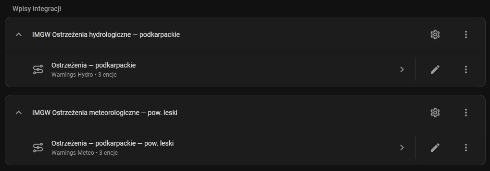
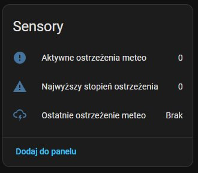
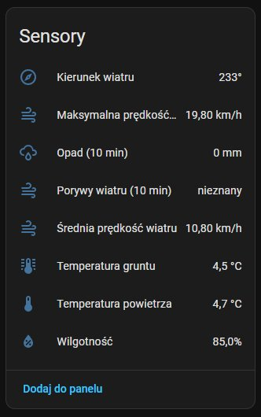

# IMGW-PIB Monitor for Home Assistant

[](https://github.com/hacs/integration)
[](https://github.com/abnvle/ha-imgw-pib-monitor/releases)
[](https://github.com/abnvle/ha-imgw-pib-monitor/blob/main/LICENSE)

[Wersja polska](README.md)

Custom Home Assistant integration for [IMGW-PIB](https://danepubliczne.imgw.pl/) — the Polish Institute of Meteorology and Water Management public data API.

## Features

- **Config Flow UI** — add through Settings → Integrations, no YAML needed
- **5 data sources** — synoptic, hydrological, meteorological, meteo warnings, hydro warnings
- **24 sensors** — temperature, wind, humidity, pressure, water level, flow, and more
- **Meteo warnings by powiat** — filter warnings down to county (powiat) level using TERYT codes
- **Options Flow** — change station, region, or update interval at any time
- **Multi-instance** — add the integration multiple times for different stations and data types
- **Polish & English translations**
- **No API key required** — uses publicly available data

## Screenshots

| Integration entries | Meteo warnings | Meteorological data |
|:---:|:---:|:---:|
|  |  |  |

## Sensors

### Synoptic (6 sensors)

| Sensor | Unit |
|---|---|
| Temperature | °C |
| Wind speed | m/s |
| Wind direction | ° |
| Humidity | % |
| Precipitation | mm |
| Atmospheric pressure | hPa |

### Hydrological (4 sensors)

| Sensor | Unit |
|---|---|
| Water level | cm |
| Water flow | m³/s |
| Water temperature | °C |
| Ice phenomenon | code |

### Meteorological (8 sensors)

| Sensor | Unit |
|---|---|
| Air temperature | °C |
| Ground temperature | °C |
| Average wind speed | m/s |
| Maximum wind speed | m/s |
| Wind gust (10 min) | m/s |
| Wind direction | ° |
| Humidity | % |
| Precipitation (10 min) | mm |

### Meteo warnings (3 sensors)

| Sensor | Description |
|---|---|
| Active warnings count | Number of current warnings |
| Max warning level | Highest active warning level (1–3) |
| Latest warning | Most severe warning with full details in attributes |

### Hydro warnings (3 sensors)

| Sensor | Description |
|---|---|
| Active warnings count | Number of current warnings |
| Max warning level | Highest active warning level |
| Latest warning | Most severe warning with full details in attributes |

## Installation

### HACS (recommended)

1. Open HACS in Home Assistant
2. Click **⋮** → **Custom repositories**
3. Add `https://github.com/abnvle/ha-imgw-pib-monitor` with category **Integration**
4. Search for **IMGW-PIB Monitor** and install
5. Restart Home Assistant

### Manual

1. Download the [latest release](https://github.com/abnvle/ha-imgw-pib-monitor/releases)
2. Copy `custom_components/imgw_pib_monitor` to your `custom_components/` directory
3. Restart Home Assistant

## Configuration

1. Go to **Settings → Devices & Services → Add Integration**
2. Search for **IMGW-PIB Monitor**
3. Select data type
4. Choose station or region:
   - **Synoptic / Hydro / Meteo** → select a measurement station
   - **Meteo warnings** → select voivodeship → select powiat or "Entire voivodeship"
   - **Hydro warnings** → select voivodeship
5. Set update interval (5–120 minutes)

To monitor multiple stations or data types, add the integration again.

## Options

| Option | Default | Description |
|---|---|---|
| Update interval | 30 min (data) / 15 min (warnings) | How often to poll the API |
| Station | — | Change the measurement station |
| Voivodeship | — | Change the warning region |
| Powiat | Entire voivodeship | Narrow meteo warnings to a specific county |

## Automation examples

### Meteo warning notification
```yaml
automation:
  - alias: "IMGW meteo warning"
    trigger:
      - platform: numeric_state
        entity_id: sensor.ostrzezenia_malopolskie_warnings_meteo_count
        above: 0
    action:
      - service: notify.mobile_app
        data:
          title: "⚠️ IMGW Warning"
          message: >
            {{ state_attr('sensor.ostrzezenia_malopolskie_warnings_meteo_latest', 'content') }}
```

### Frost alert
```yaml
automation:
  - alias: "Frost alert"
    trigger:
      - platform: numeric_state
        entity_id: sensor.imgw_synoptyczne_krakow_temperature
        below: -15
    action:
      - service: notify.mobile_app
        data:
          title: "🥶 Severe frost!"
          message: "Temperature dropped to {{ states('sensor.imgw_synoptyczne_krakow_temperature') }}°C"
```

## Data source

All data comes from the IMGW-PIB public API:
- `https://danepubliczne.imgw.pl/api/data/synop`
- `https://danepubliczne.imgw.pl/api/data/hydro`
- `https://danepubliczne.imgw.pl/api/data/meteo`
- `https://danepubliczne.imgw.pl/api/data/warningsmeteo`
- `https://danepubliczne.imgw.pl/api/data/warningshydro`

> Data provided by Instytut Meteorologii i Gospodarki Wodnej – Państwowy Instytut Badawczy.

## Author

**Łukasz Kozik** — [lkozik@evilit.pl](mailto:lkozik@evilit.pl)

## License

[MIT](https://github.com/abnvle/ha-imgw-pib-monitor/blob/main/LICENSE)