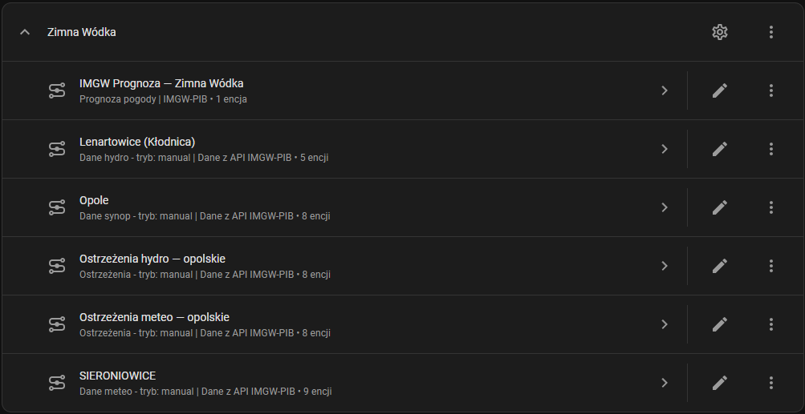
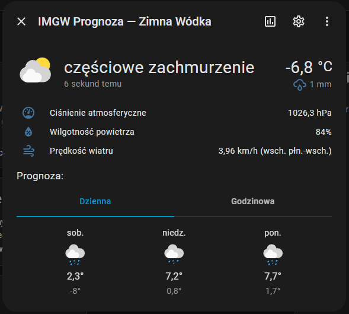
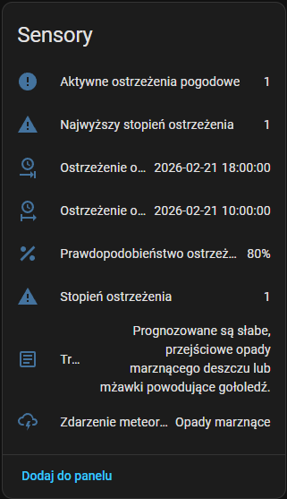
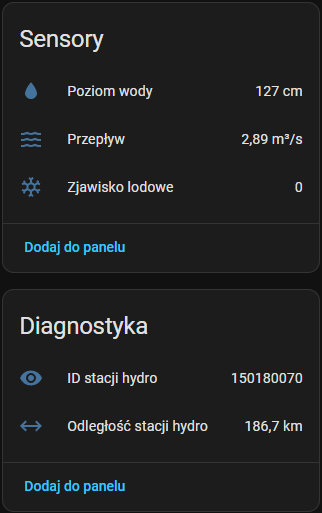

# IMGW-PIB Monitor for Home Assistant

[](https://github.com/hacs/integration)
[](https://github.com/abnvle/ha-imgw-pib-monitor/releases)
[](https://github.com/abnvle/ha-imgw-pib-monitor/releases)
[](https://github.com/abnvle/ha-imgw-pib-monitor/blob/main/LICENSE)

[Wersja polska](README.md)

Home Assistant integration using public data from IMGW-PIB (Institute of Meteorology and Water Management - National Research Institute). Provides weather, hydrological, and warning data for any location in Poland.

[](https://my.home-assistant.io/redirect/hacs_repository/?owner=abnvle&repository=ha-imgw-pib-monitor&category=integration)

## Features

### Basic

- **Two configuration modes** - automatic (GPS) or manual (enter location)
- **Config Flow UI** - configuration through interface, zero YAML
- **5 data sources** - synoptic, hydrological, meteorological, meteo warnings, hydro warnings
- **Up to 40 sensors** - temperature, wind, humidity, pressure, water level, flow, warnings and more
- **Weather entity** - weather forecast (daily and hourly) from IMGW-PIB as a weather entity
- **Multiple instances** - add integration multiple times for different locations
- **Polish & English translations**
- **No API key required** - data from public IMGW-PIB API

### Advanced

- **Auto-Discovery** - automatic detection and update of nearest stations based on Home Assistant location
- **Geocoding** - location search by name with suggestions (municipality, county, voivodeship)
- **County-level warning filtering** - precise filtering of meteorological and hydrological warnings with TERYT codes
- **Automatic region detection** - system recognizes region based on coordinates
- **Distance calculation** - each sensor shows distance to measurement station
- **Global coordinator** - centralized data fetching with rate limiting, saves API requests
- **Options Flow** - change update interval and toggle weather forecast at any time (5-120 minutes)
- **Geographic coordinates** - all sensors contain station coordinates in attributes
- **Weather forecast** - optional weather entity with daily and hourly forecast (data from IMGW API Proxy)

## Screenshots

### Integration entries
Each location creates separate devices — measurement stations, warnings and weather forecast.



---

<table>
<tr>
<td width="50%">

### Weather forecast
Weather entity with current conditions, daily and hourly forecast.



</td>
<td width="50%">

### Meteorological warnings
8 sensors per warning type — from active count to full warning text.



</td>
</tr>
</table>

---

### Hydrological data
Measurement sensors (water level, flow, ice phenomenon) and diagnostic sensors (station ID, distance).



## Configuration modes

### Automatic mode (Auto-Discovery)

The system uses GPS coordinates from Home Assistant configuration. After selecting this mode, the integration automatically searches for the nearest measurement stations of all types (synoptic, hydrological, meteorological) within 50 km radius. In the next step you can choose which data types to monitor.

Automatic mode features:
- Automatic detection of nearest station for each data type
- Dynamic station updates if Home Assistant location changes
- Automatic recognition of voivodeship and county for warnings
- One integration entry handles all selected data types

### Manual mode

The system asks for a city name or address. After entering, the name is searched using IMGW API Proxy, which returns a list of suggestions with full details (city name, municipality, county, voivodeship, TERYT code). After selecting a location, the system searches for nearest measurement stations.

Manual mode features:
- Location search by name with data from IMGW API
- Automatic retrieval of TERYT county code from API
- Automatic recognition of voivodeship and county
- Ability to select any location in Poland
- Results sorted by rank (most important places first)
- One integration entry handles all selected data types

## Sensors

### Synoptic (8 sensors)

| Sensor | Unit | Type |
|---|---|---|
| Temperature | °C | Measurement |
| Wind speed | m/s | Measurement |
| Wind direction | ° | Measurement |
| Humidity | % | Measurement |
| Precipitation | mm | Measurement |
| Atmospheric pressure | hPa | Measurement |
| Synop station ID | - | Diagnostic |
| Synop distance | km | Diagnostic |

Attributes: station name, station ID, measurement date, measurement time, geographic coordinates, distance

### Hydrological (6 sensors)

| Sensor | Unit | Type |
|---|---|---|
| Water level | cm | Measurement |
| Water flow | m³/s | Measurement |
| Water temperature | °C | Measurement |
| Ice phenomenon | code | Measurement |
| Hydro station ID | - | Diagnostic |
| Hydro distance | km | Diagnostic |

Attributes: station name, station ID, river name, voivodeship, geographic coordinates, distance, measurement dates for individual parameters

### Meteorological (10 sensors)

| Sensor | Unit | Type |
|---|---|---|
| Air temperature | °C | Measurement |
| Ground temperature | °C | Measurement |
| Average wind speed | m/s | Measurement |
| Maximum wind speed | m/s | Measurement |
| Wind gust (10 min) | m/s | Measurement |
| Wind direction | ° | Measurement |
| Humidity | % | Measurement |
| Precipitation (10 min) | mm | Measurement |
| Meteo station ID | - | Diagnostic |
| Meteo distance | km | Diagnostic |

Attributes: station name, station code, geographic coordinates, distance

### Meteorological warnings (8 sensors)

| Sensor | Description | Type |
|---|---|---|
| Active warnings count | Number of current warnings | Measurement |
| Max warning level | Highest active level (1-3) | - |
| Latest event name | Name of most severe warning | - |
| Latest event level | Level of most severe warning | - |
| Latest event probability | Probability of latest warning (%) | - |
| Latest valid from | Start of validity period | - |
| Latest valid to | End of validity period | - |
| Latest warning content | Warning text (max 255 chars) | - |

The "Active warnings count" sensor contains a `warnings` attribute with the full list of all active warnings.

Warnings can be filtered by:
- Voivodeship (16 voivodeships)
- County (more precise filtering) - optional

### Hydrological warnings (8 sensors)

| Sensor | Description | Type |
|---|---|---|
| Active warnings count | Number of current hydro warnings | Measurement |
| Max hydro warning level | Highest active level | - |
| Latest hydro event name | Name/description of most severe warning | - |
| Latest hydro event level | Level of most severe warning | - |
| Latest hydro probability | Probability of latest warning (%) | - |
| Latest hydro valid from | Start of validity period | - |
| Latest hydro valid to | End of validity period | - |
| Latest hydro description | Warning description (max 255 chars) | - |

The "Active warnings count" sensor contains a `warnings` attribute with the full list of all active hydrological warnings.

Warnings can be filtered by:
- Voivodeship (16 voivodeships)
- County (search in area descriptions) - optional

### Weather forecast (weather entity)

Optional `weather.*` entity with data from IMGW API Proxy. Supports:

| Property | Description |
|---|---|
| Condition | Based on IMGW icon (sunny, cloudy, rain etc.) |
| Temperature | Current air temperature (°C) |
| Apparent temperature | Feels-like temperature (°C) |
| Humidity | Air humidity (%) |
| Pressure | Atmospheric pressure (hPa) |
| Wind speed | Wind speed (m/s) |
| Wind gust | Wind gust speed (m/s) |
| Wind bearing | Wind direction (°) |
| Cloud coverage | Cloud coverage (%) |

Extra attributes: precipitation, snow, sunrise/sunset, IMGW icon, forecast model.

Forecasts:
- **Daily** - max/min temperature, wind, precipitation (day/night merged)
- **Hourly** - full weather data for each hour

## Installation

### HACS (recommended)

1. Open HACS in Home Assistant
2. Click **⋮** - **Custom repositories**
3. Add `https://github.com/abnvle/ha-imgw-pib-monitor` with category **Integration**
4. Search for **IMGW-PIB Monitor** and install
5. Restart Home Assistant

### Manual

1. Download the repository
2. Copy `custom_components/imgw_pib_monitor` to your `custom_components/` directory
3. Restart Home Assistant

## Configuration

### Automatic mode

1. Go to **Settings - Devices & Services - Add Integration**
2. Search for **IMGW-PIB Monitor**
3. Select **Automatic (GPS)**
4. System will find nearest stations for all data types
5. Select data types you want to monitor:
   - Synoptic data (weather)
   - Meteorological data (detailed meteorology)
   - Hydrological data (rivers)
   - Meteorological warnings
   - Hydrological warnings
6. For warnings you can optionally enable county-level filtering
7. Optionally enable weather forecast (weather entity)
8. Confirm configuration

### Manual mode

1. Go to **Settings - Devices & Services - Add Integration**
2. Search for **IMGW-PIB Monitor**
3. Select **Manual (enter location)**
4. Enter city name or address
5. Select appropriate location from suggestion list
6. System will find nearest stations for all data types
7. Select data types you want to monitor
8. For warnings you can optionally enable county-level filtering
9. Optionally enable weather forecast (weather entity)
10. Confirm configuration

### Multiple instances

You can add the integration multiple times for different locations. Each instance works independently and can monitor different data types.

## Options

After adding the integration you can change settings:

1. Go to **Settings - Devices & Services**
2. Find **IMGW-PIB Monitor** entry
3. Click **CONFIGURE**
4. Set new update interval (5-120 minutes)
5. Enable or disable weather forecast (weather entity)

Default update interval: 30 minutes. The global coordinator syncs to the shortest interval across all instances.

## How the global coordinator works

The integration uses two-tier coordinator architecture:

1. **Global coordinator** - fetches all data from IMGW-PIB API. The interval syncs to the shortest interval across all integration instances. Uses rate limiting (2 concurrent requests with 200ms delay) to avoid overwhelming the API.

2. **Instance coordinators** - each integration instance has its own coordinator that filters data from global coordinator and prepares it for its sensors. Updates occur according to set interval.

3. **Forecast coordinator** (optional) - separate coordinator fetching weather forecast from IMGW API Proxy for the weather entity.

Benefits:
- One API request serves all integration instances
- Reduced load on IMGW-PIB API
- Better Home Assistant performance
- Possibility of more frequent updates without worrying about API overload

## TERYT codes

TERYT county codes and names are fetched directly from IMGW API Proxy during configuration. The integration does not contain a local code database - this ensures it always uses up-to-date data without requiring updates after administrative changes.

TERYT codes are used for:
- Filtering meteorological warnings (API returns warnings with TERYT codes)
- Filtering hydrological warnings (searching county name in area descriptions)
- Automatic county detection based on geocoding

TERYT code format: `AABB` where:
- `AA` - voivodeship code (02-32)
- `BB` - county code (01-99)

Examples:
- `1201` - Bochnia county (Malopolskie voivodeship)
- `1261` - Krakow city (city with county rights)
- `1465` - Warsaw city

## Station coordinates

### Synoptic stations (SYNOP)

IMGW-PIB API does not return coordinates for synoptic stations. The integration contains hardcoded coordinate database for all 64 synoptic stations in Poland. Coordinates are used for:
- Calculating distance to station
- Automatic selection of nearest station in auto-discovery mode
- Displaying station location in sensor attributes

### Hydrological and meteorological stations

For these stations coordinates are fetched directly from IMGW-PIB API.

## Automatic updates in Auto-Discovery mode

In automatic mode the integration continuously checks if Home Assistant location has changed. If it detects GPS coordinate changes, it automatically updates selected stations to nearest available. Thanks to this:
- Integration works correctly after location change (e.g. moving installation)
- You always use data from nearest stations
- No need to manually reconfigure integration

Update applies only to data types that were enabled during configuration.

## Automatic region detection

The system automatically detects voivodeship and county based on:

### In automatic mode
- Data from IMGW API Proxy (reverse geocoding - GPS coordinates -> nearest location)
- API returns voivodeship name, county name, and TERYT code
- Fallback: distance to voivodeship capitals if API doesn't return data

### In manual mode
- Data from IMGW API Proxy (location name includes voivodeship, county, TERYT code)
- TERYT county code and name are retrieved directly from API

Detected region is used for:
- Filtering meteorological and hydrological warnings by TERYT code
- Displaying information in device names
- Automatic warning configuration

## Automation examples

### New meteo warning notification

```yaml
automation:
  - alias: "IMGW warning"
    trigger:
      - platform: numeric_state
        entity_id: sensor.imgw_auto_discovery_warnings_meteo_count
        above: 0
    action:
      - service: notify.mobile_app
        data:
          title: "Meteorological warning"
          message: >
            {{ state_attr('sensor.imgw_auto_discovery_warnings_meteo_latest', 'event') }}
            Level: {{ state_attr('sensor.imgw_auto_discovery_warnings_meteo_latest', 'level') }}
            Valid: {{ state_attr('sensor.imgw_auto_discovery_warnings_meteo_latest', 'valid_from') }} - {{ state_attr('sensor.imgw_auto_discovery_warnings_meteo_latest', 'valid_to') }}
```

### Frost alert

```yaml
automation:
  - alias: "Frost alert"
    trigger:
      - platform: numeric_state
        entity_id: sensor.imgw_auto_discovery_temperature
        below: -15
    action:
      - service: notify.mobile_app
        data:
          title: "Severe frost"
          message: "Temperature dropped to {{ states('sensor.imgw_auto_discovery_temperature') }}°C at {{ state_attr('sensor.imgw_auto_discovery_temperature', 'station_name') }}"
```

### High water level alert

```yaml
automation:
  - alias: "Water level alert"
    trigger:
      - platform: numeric_state
        entity_id: sensor.imgw_auto_discovery_water_level
        above: 500
    action:
      - service: notify.mobile_app
        data:
          title: "High water level"
          message: >
            Water level in {{ state_attr('sensor.imgw_auto_discovery_water_level', 'river') }}
            at {{ state_attr('sensor.imgw_auto_discovery_water_level', 'station_name') }}
            is {{ states('sensor.imgw_auto_discovery_water_level') }} cm
```

### Strong wind notification

```yaml
automation:
  - alias: "Strong wind alert"
    trigger:
      - platform: numeric_state
        entity_id: sensor.imgw_auto_discovery_wind_speed
        above: 15
    action:
      - service: notify.mobile_app
        data:
          title: "Strong wind"
          message: "Wind speed: {{ states('sensor.imgw_auto_discovery_wind_speed') }} m/s ({{ (states('sensor.imgw_auto_discovery_wind_speed') | float * 3.6) | round(0) }} km/h)"
```

### Dashboard with warnings and weather

```yaml
type: vertical-stack
cards:
  - type: entities
    title: IMGW Warnings
    entities:
      - entity: sensor.imgw_auto_discovery_warnings_meteo_count
        name: Active meteo warnings
      - entity: sensor.imgw_auto_discovery_warnings_meteo_max_level
        name: Highest level
      - entity: sensor.imgw_auto_discovery_warnings_meteo_latest
        name: Latest warning
      - entity: sensor.imgw_auto_discovery_warnings_hydro_count
        name: Active hydro warnings
  - type: weather-forecast
    entity: weather.home
  - type: entities
    title: IMGW Data
    entities:
      - entity: sensor.imgw_auto_discovery_temperature
        name: Temperature
      - entity: sensor.imgw_auto_discovery_wind_speed
        name: Wind
      - entity: sensor.imgw_auto_discovery_humidity
        name: Humidity
      - entity: sensor.imgw_auto_discovery_pressure
        name: Pressure
```

## API limits and optimization

IMGW-PIB API does not require a key and has no official limits, but it's worth being reasonable:

- **Global coordinator** fetches data according to shortest instance interval (default 30 minutes)
- **Rate limiting** - maximum 2 concurrent requests with 200ms delay
- **Cache** - all instances use the same data
- **Timeout** - requests timeout after 30 seconds

Recommendations:
- Don't set interval below 5 minutes
- For multiple instances use the same interval
- API data is updated hourly, no point polling more often than every 15 minutes

## Troubleshooting

### No stations nearby

If system doesn't find any stations within 50 km:
- Check if GPS coordinates in Home Assistant are correct
- Try manual mode and enter nearest large city
- Some station types (especially hydrological) are not available everywhere

### Incorrect data

If sensors show `unavailable` or `None`:
- Check Home Assistant logs (`Settings - System - Logs`)
- Some stations don't report all parameters
- IMGW-PIB API sometimes returns empty values

### Warnings not filtered by county

- Check if county was detected (information in logs)
- For hydro warnings filtering only works if county name appears in area descriptions
- You can disable county filtering and keep only voivodeship

### Data not updating

- Check update interval in integration options
- Check if global coordinator is fetching data (logs)
- Check Home Assistant internet connection

## Data source

Data comes from public IMGW-PIB API:
- `https://danepubliczne.imgw.pl/api/data/synop`
- `https://danepubliczne.imgw.pl/api/data/hydro`
- `https://danepubliczne.imgw.pl/api/data/meteo`
- `https://danepubliczne.imgw.pl/api/data/warningsmeteo`
- `https://danepubliczne.imgw.pl/api/data/warningshydro`

Weather forecast:
- `https://imgw-api-proxy.evtlab.pl/forecast`

> Measurement data provided by Instytut Meteorologii i Gospodarki Wodnej - Panstwowy Instytut Badawczy (Institute of Meteorology and Water Management - National Research Institute).

## Author

**Lukasz Kozik** - [lkozik@evilit.pl](mailto:lkozik@evilit.pl)

## Acknowledgments

Thanks to [Allon](https://github.com/AllonGit/) for help in creating the integration.

## License

[MIT](https://github.com/abnvle/ha-imgw-pib-monitor/blob/main/LICENSE)
